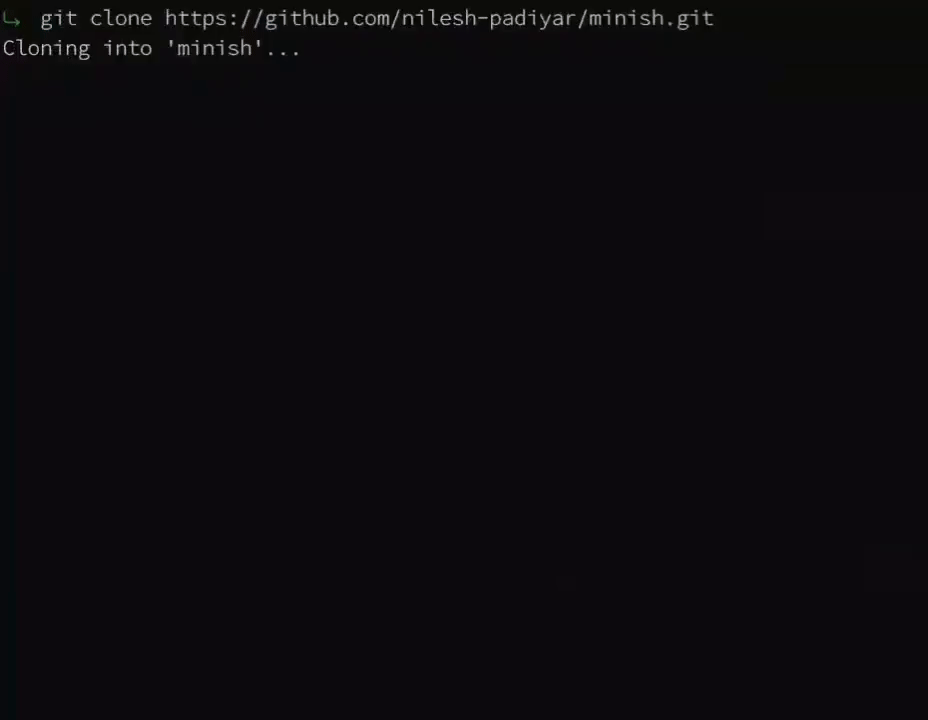

# minish

A tiny Unix shell written in C, built from scratch for learning process creation, argument parsing, file descriptors, redirection, and program execution.

> **minish is a learning project, not a replacement for Bash, Zsh, or other full-featured shells.**

---

## Demo



---

## ✨ Features

Currently, minish supports:

* Running external commands
* Command-line arguments
* `fork()` for creating child processes
* `execvp()` for executing commands
* `waitpid()` for waiting for child processes
* Basic command parsing
* Interactive shell prompt
* Output redirection using `>` & `>>`
* Error redirection using `2>` & `2>>`
* File creation, truncation and append using `open()`
* File descriptor duplication using `dup2()`

---

## 🚧 Not Supported Yet

The initial versions intentionally keep things simple.

minish does **not** currently support:

* Pipes (`|`)
* Input redirection (`<`)
* Background processes (`&`)
* Environment variable expansion
* Quoting and escaping
* Command history
* Tab completion
* Shell scripting
* Built-in commands such as `cd`

These may be explored in future versions.

## 🛠️ Building

Clone the repository:

```bash
git clone https://github.com/nilesh-padiyar/minish.git
cd minish
```

Compile with GCC/Clang and GNU Make:

```bash
make
```

Then run:

```bash
./minish
```

---

## 💻 Usage

Start minish:

```text
$ ./minish

minish $
```

Enter any command available on your system:

```text
minish $ ls
minish $ pwd
/home/user
minish $ fastfetch
```

### Output Redirection

minish supports output/append redirection using `>` and `>>` respectively:

```text
minish $ echo "hello world" > hello.txt
minish $ echo "hello again" >> hello.txt
```

The command's standard output (`stdout`) is redirected to `hello.txt` instead of the terminal.

For example:

```text
minish $ cat hello.txt
hello world
hello again
```

### Error Redirection

minish supports error output/append redirection using `2>` and `2>>` respectively:

```text
minish $ cat hello 2> error.txt
minish $ cat hi 2>> error.txt
```

The command's standard error (`stderr`) is redirected to `error.txt` instead of the terminal.

For example:

```text
minish $ cat error.txt
cat: hello: No such file or directory
cat: hi: No such file or directory
```

> If the specified file does not exist, minish creates it. If it already exists, its contents are truncated/appended before the command runs.

To exit, use:

```text
minish $ exit
```

## 🧠 Why I Built This

This project was created primarily to understand how a Unix shell works internally.

Instead of using a library or framework that abstracts away process management, minish works directly with **POSIX** system calls such as:

```text
fork()
execvp()
waitpid()
open()
dup2()
```

Building a shell was a practical way to learn how processes are created, how programs are executed, how file descriptors work, and how a shell can modify a child process's standard streams before execution.

---

## 📚 What I Learned

While building minish, I worked with:

* Process creation
* Process synchronization
* `fork()` / `exec()` workflow
* `argc` / `argv`
* Argument parsing
* POSIX system calls
* File descriptors
* Output redirection (`stdout`)
* Error Redirection (`stderr`)
* `open()` and file access flags
* `dup2()` and file descriptor duplication
* Error handling in C
* Memory management
* GCC warning flags and strict compilation

---

## 📄 License

This project is licensed under the MIT License. See [`LICENSE`](LICENSE) for details.

---
